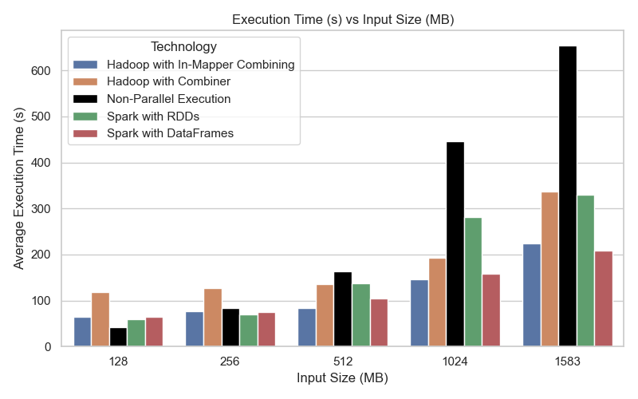
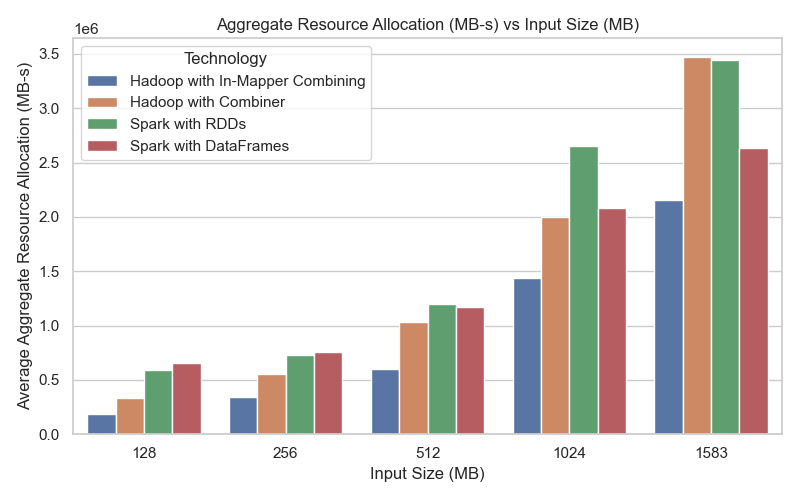
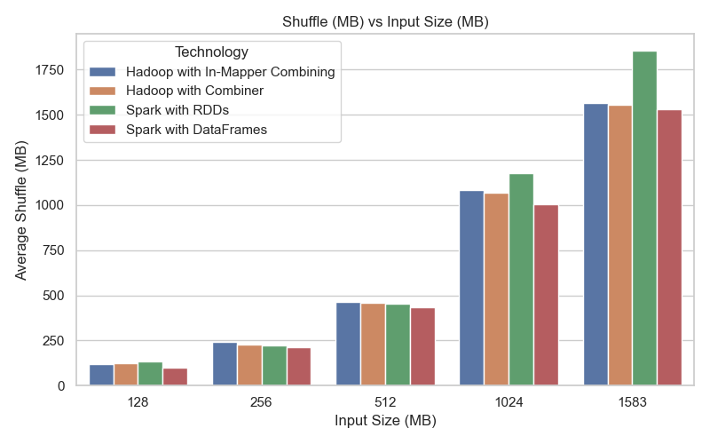
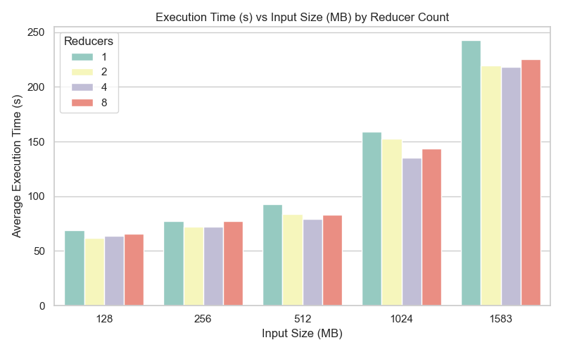
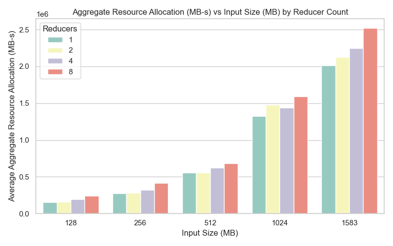

# Inverted Index and Search
Cloud Computing project, a.y. 2024/2025

Univeristy of Pisa,
Department of Information Engineering, 
m.sc. Computer Engineering / m.sc. Artificial Intelligence and Data Engineering


Francesco Panattoni,
Lorenzo Vezzani,
Hajar Makhlouf

## Introduction  
Our project for the Cloud Computing course involves developing a basic search engine backend through the construction of an **Inverted Index**, a fundamental data structure in information retrieval systems such as **Google Search**. The main goal is to process a collection of text files and efficiently map each word to the files in which it appears, along with the frequency of its occurrences. Subsequently we had to analyze and compare the performance of a Java-based application using the **Hadoop** framework with that of a Python-based application using the **Spark** framework. Finally we have to build a **search query** in Python based on the inverted indexes produced.

We focused on optimizing the code by conducting extensive testing aimed at improving both execution time and memory usage.

## Equipment
The tests were conducted on three identical virtual machines, each configured with the following hardware and software specifications:

- **CPU**: 2 virtual CPUs (vCPUs), mapped to Intel(R) Xeon(R) Silver 4208 CPU @2.10GHz, provided via KVM virtualization
- **RAM**: 6.8 GB of system memory
- **Disk**: 40 GB of allocated virtual storage (ext4 filesystem)
- **Operating System**: Ubuntu 22.04.1 LTS (Jammy Jellyfish), 64-bit

## Dataset
We selected a 1583.5 MB corpus of 2685 plaintext files from [Project Gutenberg](https://www.gutenberg.org/), covering diverse fields including philosophy, science, theology, psychology, literature and other cultural subjects, to stress and test our indexers across a broad range of real-world texts. This variety tests the system against typical literary content as well as challenging patterns, mirroring real-world search engine demands on both natural language and specialized data. File sizes vary from 5 KB to 250 MB: most are under 1 MB, 329 fall between 1 MB and 7 MB and one extreme outlier ("Human\_Genome\_Project-Chromosome\_1.txt", 250 MB) contains raw nucleotide sequences. Including this genomic text deliberately exposes our inverted-index builder to vast, mostly unique tokens-mimicking workloads with high vocabulary cardinality and ensuring our system handles both common-word skew and near-unique string distributions. By including files ranging from kilobytes to megabytes, the dataset enables a rigorous evaluation of how indexing and search-query systems scale with input size. 

## HDFS "inverted-index" structure folder
The directory `inverted-index` in HDFS contains the following subfolders:

- `data`: contains all the `.txt` files to be analyzed by the inverted index and search applications.

- `data-128MB`, `data-256MB`, `data-512MB`, `data-1024MB`: each of these directories contains a subset of the input data limited to a maximum total size of the corresponding value (128MB, 256MB, etc.). These are used to optimize input handling for distributed programs, such as those implemented with Spark.

- `log`: stores the log files generated by the various applications during execution.

- `output`: contains the output directories produced by the Hadoop, Spark, and sequential (non-parallel) implementations of the inverted index.

- `search`: contains the results produced by the search query system that operates on the generated inverted index.

## MapReduce and Hadoop code
The system uses **MapReduce**, via the **Hadoop** framework, to process large-scale data efficiently. The Hadoop cluster is optimized for virtual machines with limited memory through customized YARN and MapReduce settings. YARN manages resources and memory (up to 5 GB per node), while MapReduce configurations allocate 2048 MB to key tasks, with JVM heaps limited ot 1536 MB.

``` PseudoCode
class TokenizerMapperStateful

	method initialize()
		word_counts <= New Empty AssociativeArray()
	end method
	
	method map(offset o, doc d)
		Filename <= retrieve_file_name()
		
		for all term t in doc d do
			if word_counts[t] does not contain Filename then
				word_counts[t][Filename] <= 1
			else
				word_counts[t][Filename] <= word_counts[t][Filename] + 1
			end if
		end for
		
		if word_counts.size() > FLUSH_THRESHOLD then
			flush(context)
		end if
	end method
	
	method flush(context)
		for each word in word_counts do
			for each filename in word_counts[word] do
				value <= filename + ":"+ 
				+word_counts[word][filename]
				
				emit(word, value)
			end for
		end for
		clear word_counts
	end method
	
	method cleanup(context)
		flush(context)
	end method

end class
		
```

<span id="fig:pseudocode-stateful-mapper" label="fig:pseudocode-stateful-mapper"></span>

``` PseudoCode
class TokenizerMapper
	method map(offset o, doc d)
		Filename <= retrieve_file_name()
		for all term t in doc d do
			emit(term t, filename + ":1")
		end for
	end method
end class
		
```

<span id="fig:pseudocode-stateless-mapper" label="fig:pseudocode-stateless-mapper"></span>

``` PseudoCode
class DocumentCountReducer
	method reduce(term, postingsList)
		docCounts <= {}
		for all posting in postingsList do
			for pair in split(posting, ",") do
				doc, cnt <= splitLast(pair, ":")
				docCounts[doc] docCounts.get(doc, 0) + toInt(cnt)
			endfor
		endfor
	emit(term, format(docCounts))
	end method
end class
			
```

<span id="fig:pseudocode-reducer" label="fig:pseudocode-reducer"></span>

The application offers two interchangeable MapReduce variants: a classic **Mapper with optional Combiner** and a **Stateful In-Mapper Combiner**, selectable via command-line flags for modularity and flexibility.

To address Hadoop’s inefficiency with many small files, we use `CombineFileSplit` to reduce task overhead.

In Hadoop, the `CombineFileInputFormat` class does not know by itself how to read each individual file within a `CombineFileSplit`. For this reason, it requires a **custom RecordReader** for each combined file. This is the job of `MyCombineTextInputFormat`.

`MyCombineFileRecordReaderWrapper` is a wrapper around LineRecordReader, which reads one line at a time as in a normal Hadoop job. Its main function, however, is another: **it keeps track of the name of the file it is reading from**, using a `ThreadLocal` object. This is essential for an inverted index, because each word read from the line must be associated with the document (i.e. the file) in which it appears.

The `TokenizerMapStateful` class accumulates word counts in memory using a data structure initialized in `setup()`, mapping words to document-specific counts. Once a predefined **threshold** is exceeded, it triggers a **flush**, emitting partial results in the format: ⟨**word**, **doc-id:count**⟩

Residual data is emitted during `cleanup()`.

In contrast, the `TokenizerMapper` class (lacking in-mapper combining) directly emits key-value pairs of the form:
⟨**word**, **doc-id:1**⟩

The `CombinerDocCounts` class implements the Combiner logic, aggregating intermediate values by summing occurrences per document:
⟨**word**, **doc-id:count**⟩

Finally, the `DocumentCountReducer` consolidates all partial counts per word across files and formats the output as:

`word \t filename1:count1 \t filename2:count2`

## How to Run the Hadoop Inverted Index Project
### Compilation
To compile the project, navigate to the `hadoop` directory (where the `pom.xml` is located) and run:

    mvn clean package

This will generate a JAR file in the `target/` folder.

### Execution

To run the MapReduce job on the default input folder (`hdfs:///user/hadoop/inverted-index/data/`), use:

    hadoop jar target/inverted-index-search-1.0.0-SNAPSHOT.jar \
        it.unipi.hadoop.InvertedIndexAndSearch

### Optional Command-Line Flags
The execution can be customized using the following optional flags:

- `--reducers <num>`  
  Sets the number of reducers used in the job.

- `--input-folder <folder>`  
  Specifies a folder (relative to `/user/hadoop/`) in HDFS from which   all `.txt` files will be loaded as input.

- `--input-texts <file1> <file2> ...`  
  Specifies an explicit list of files (relative to `/user/hadoop/`) to be used as input.

- `--limit-mb <N>`  
  Limits the total size of input files to approximately `N` megabytes (only in default mode).

- `--output <path>`  
  Changes the root output directory (relative to `/user/hadoop/`) where the results will be written.

- `--combiner`  
  Uses the `CombinerDocCounts` class as a combiner to optimize shuffle size.

- `--no-combiner`  
  Disables all combiners, switching to the basic `TokenizerMapper` implementation.

If no input or output is specified, the program uses the following defaults:

- **Input directory:** `hdfs:///user/hadoop/inverted-index/data/`

- **Output directory root:** `hdfs:///user/hadoop/inverted-index/output/`

The output folder is automatically generated with a suffix (e.g., `output-hadoop0`, `output-hadoop1`, etc.) to avoid overwriting previous runs.

### Example Usage

    hadoop jar target/inverted-index-search-1.0.0-SNAPSHOT.jar \
        it.unipi.hadoop.InvertedIndexAndSearch \
        --reducers 4 \
        --input-folder inverted-index/data-128MB \
        --output inverted-index/search \
        --combiner

## Spark code
The Spark-related Python code was implemented based on the functional patterns and structure demonstrated during the lectures. **Apache Spark** is an open-source, distributed data processing engine designed for fast in-memory analytics and large-scale workload orchestration. Spark doesn’t strictly use **MapReduce**, but it supports map and reduce operations but runs them within a more flexible **DAG** execution model rather than the rigid two-stage MapReduce paradigm.

Spark jobs were executed on YARN with event logging and the Spark History Server enabled. The configuration included Kryo serialization, dynamic allocation with 3 executors (2 cores and 3GB RAM each), and speculative execution to handle stragglers—ensuring effective resource utilization and monitoring.

**RDD_inverted_index_search.py** constructs an inverted index using `RDDs`. It loads documents from HDFS via `wholeTextFiles`, generating `(path, content)` pairs. Text is tokenized by lowercasing, removing non-alphanumerics, and splitting into words, producing key-value pairs of the form: ((**word**, **docID**), 1)

These are aggregated using `reduceByKey`, mapped to `(word, (docID, count))`, and grouped by key to produce sorted postings lists. Partitioning is adjusted dynamically (1 partition per 44MB) to ensure workload balance. The final output can be saved as tab-delimited text, JSON, or Parquet, generating a distributed inverted index. This is the format of the final output:

`word \t filename1:count1 \t filename2:count2`

However, this code exhibited suboptimal performance, which was below our expectations for Spark. Therefore, we developed a second version implemented using Spark `DataFrames`. Spark’s **DataFrames** wrap RDDs with a schema and declarative API, letting Spark Catalyst optimizer and Tungsten execution engine apply column-level and query-plan optimizations for far better performance and memory use than raw RDDs.

In the new **inverted_index_search.py**, it first loads each specified path into a unified DataFrame annotated with a filename column, gracefully skipping any unreadable files. It then applies a sequence of Spark SQL transformations: all non‐alphanumeric characters are stripped via `regexp_replace`, text is lowercased and split on whitespace and each word is exploded into its own row. Empty tokens are filtered out to ensure data quality. So we have a more optimized **tokenization**. In the next phase, the code groups by word and filename to compute per‐document term frequencies, then concatenates these as filename:count strings. A second grouping by word collects and sorts the full postings list into an array, producing one row per unique term with its complete, ordered document list. Finally the output is either written as plain text (with words and tab‐separated postings) JSON, or Parquet. This approach leverages Spark’s built‐in DataFrame optimizations and avoids manual RDD manipulations while delivering a scalable inverted index. 

## How to Run the Spark with RDD Inverted Index Search
### Execution
After navigating into the `spark` directory (where `RDD_inverted_index_search.py` resides), launch the application with:

    spark-submit --master yarn RDD_inverted_index_search.py

Note: the `--master yarn` option is optional if your environment already defaults to YARN, but it is included here for clarity and will be used in all examples below.

### Default Behavior
By default, the script will:

- Read all `.txt` files under `hdfs:///user/hadoop/inverted-index/data/`.

- Build an RDD-based inverted index.

- Write text output to the next available directory under `hdfs:///user/hadoop/inverted-index/output/`, named `output-spark0`, `output-spark1`, etc.

- Save a log file under `hdfs:///user/hadoop/inverted-index/log/`, named `log-output-sparkX`.

### Optional Command‑Line Flags
You can customize execution using these flags:

`--num-partitions <int>`  
Override the number of Spark partitions for the RDD. Default: computed automatically based on total input size.

`--limit-mb <int>`  
Limit total input size (in megabytes) by selecting the largest files up to this cap. If no file fits, the smallest file is chosen.

`--format {text,json,parquet}`  
Choose output format.

- `text`: one line per term, tab‑separated `doc:count` pairs.

- `json`: one JSON object per line.

- `parquet`: a Parquet DataFrame with schema `{word, postings}`.

Default: `text`.

`--input-folder <dir> [<dir>...]`  
Read entire HDFS directories (relative to `/user/hadoop/`), e.g. `inverted-index/data-256MB/`.

`--input-texts <file> [<file>...]`  
Read specific HDFS files (relative to `/user/hadoop/`), e.g. `inverted-index/data/doc1.txt`.

`--output <subdir>`  
Write results under `hdfs:///user/hadoop/<subdir>/output-sparkX` instead of the default base.

`--log <subdir>`  
Save the log file under `hdfs:///user/hadoop/<subdir>/`. Default: `inverted-index/log/`.

### Example Usage

    spark-submit --master RDD_yarn inverted_index_search.py \
      --num-partitions 10 \
      --input-folder inverted-index/data-512MB \
      --output inverted-index/search \
      --log inverted-index/log

## How to Run the Spark with DataFrames Inverted Index Search
### Execution
After changing into the `spark` directory (where `inverted_index_search.py` resides), launch the application with:

    spark-submit --master yarn inverted_index_search.py

Although `--master yarn` can be omitted if your Spark defaults to YARN, it is included here for clarity and will appear in all examples.

### Default Behavior

By default, the script will:

- Read every text file under `hdfs:///user/hadoop/inverted-index/data/`, recursively.

- Tokenize, lowercase, and clean non‑alphanumeric characters.

- Build an inverted index using Spark DataFrame transformations.

- Write a tab‑delimited text output to the next available directory under  
  `hdfs:///user/hadoop/inverted-index/output/output-spark0`, `output-spark1`, etc.

- Save a log file under  
  `hdfs:///user/hadoop/inverted-index/log/log-output-sparkX`.

### Optional Command‑Line Flags

Use the following flags to customize behavior:

`--num-output-partitions <int>`  
Override the number of partitions for the final output DataFrame (affects `coalesce` or `repartition`). Default: DataFrame’s native partitioning.

`--limit-mb <int>`  
Cap total input volume (in MB). Spark will select the largest files up to that limit; if nothing fits, it picks the smallest single file.

`--format {text,json,parquet}`  
Specify output format:

- `text`: one line per term, tab‑separated `word`, then `filename:count` entries.

- `json`: JSON files with fields `word` and array `docs`.

- `parquet`: a Parquet table with schema `{word, docs}`.

Default: `text`.

`--input-folder <dir> [<dir>...]`  
Read entire HDFS directories (relative to `/user/hadoop/`), e.g. `inverted-index/data-256MB/`.

`--input-texts <file> [<file>...]`  
Read specific HDFS files (relative to `/user/hadoop/`), e.g. `inverted-index/data/doc1.txt`.

`--output <subdir>`  
Write results under  
`hdfs:///user/hadoop/<subdir>/output-sparkX` instead of the default base.

`--log <subdir>`  
Save the execution log under  
`hdfs:///user/hadoop/<subdir>/`. Default: `inverted-index/log/`.

### Example Usage

    spark-submit --master yarn inverted_index_search.py \
      --num-output-partitions 1 \
      --input-folder inverted-index/data-256MB \
      --output inverted-index/search \
      --log inverted-index/log

## Non‑Parallel code
The non‑parallel Python implementation builds an inverted index on a single node using a SPIMI (Single Pass In‑Memory Indexing) approach. It parses command‑line arguments for local or HDFS input/output URIs, optional size limits, and verbosity via `argparse`. Text files are read (either from HDFS via `hdfs.InsecureClient` or from the local filesystem), normalized (punctuation and underscores replaced by spaces), tokenized, and accumulated in an in‑memory index. Every `BLOCK_SIZE` files—or when the size limit is reached—the current postings are flushed to a sorted block file in a temporary directory. After all blocks are written, a multi‑way merge using a min‑heap combines block files into a single output (written back to local or HDFS), preserving term order and aggregating postings. The script prints a concise summary of block construction time, merge time, total runtime, and memory usage.

## How to Run the Non‑Parallel SPIMI Inverted Index

### Execution
After changing into the `non-parallel` directory (where `non‑parallel.py` resides), launch the script with:

    python non-parallel.py

This will:

- Read all `.txt` files under `hdfs:///user/hadoop/inverted-index/data` by default.

- Build in‑memory inverted‑index blocks, flushing every 200 files.

- Merge the blocks into a single `output.txt` under the next available directory `.../inverted-index/output/output-non-parallel0`, `output-non-parallel1`, etc.

- Print execution timing and peak memory usage to the console.

### Optional Command‑Line Flags
`--input`, `-i` *\<URI\>*  
Input directory URI (can be a local path or `hdfs://…`). Default: `hdfs:///user/hadoop/inverted-index/data`.

`--output`, `-o` *\<URI\>*  
Output base URI (local or HDFS). Results are written under `<URI>/output-non-parallelX`. Default: `hdfs:///user/hadoop/inverted-index/output`.

`--limit-mb`, `-l` *\<int\>*  
Stop reading new files once the total input size (in MB) is reached.

`--verbose`, `-v`  
Enable per-file logging (“Reading file: …”) during block construction.

### Example Usage

    python non-parallel.py \
      --input hdfs:///user/hadoop/inverted-index/data-512MB \
      --output hdfs:///user/hadoop/my-np-output \
      --verbose

## Search Query System
The `search_query.py` utility offers a unified CLI for querying inverted indexes generated by local, Hadoop or Spark runs. It defines mutually exclusive flags (`--folder`, `--hadoop`, `--spark`, `--spark‑rdd`, `--non‑parallel`) via `argparse`. Depending on the flag, it loads lines from local files or HDFS (`hdfs.InsecureClient`), then invokes `build_term_offset_index_from_lines` to map each lowercase term to its file‑line offset. During interactive querying, input terms are normalized, their postings lists retrieved by offset, and filename sets intersected to yield a sorted result list. The REPL loops until Ctrl+D, printing “No matches found.” if empty.

## How to Run the Inverted Index Search Tool
### Execution
After changing into the `inverted-index-and-search` directory, launch the search interface with:

    python search-query.py [FLAGS]

### Command‑Line Flags
Exactly one of these flags must be provided to select the index source:

`--folder <path>`  
Read index files from a local filesystem directory `<path>`.

`--hadoop`  
Read index files from the Hadoop output directory `/user/hadoop/inverted-index/search/output-hadoop`.

`--spark`  
Read index files from the Spark DataFrame output directory `/user/hadoop/inverted-index/search/output-spark-df`. (Same behavior as `--spark-df`)

`--spark-df`  
Alias for `--spark` (reads from the Spark DataFrame output).

`--spark-rdd`  
Read index files from the Spark RDD output directory `/user/hadoop/inverted-index/search/output-spark-rdd`.

`--non-parallel`  
Read index files from the non‑parallel inverted index output directory `/user/hadoop/inverted-index/search/output-non-parallel`.

Once the script starts, it will:

- Load all index lines into memory and build an in‑memory term→offset map.

- Prompt you to enter queries at the `>` prompt.

- For each query (one or more terms), display the list of document filenames that contain *all* terms.

Terminate the interactive session with Ctrl+D.

### Example Usage

    # 1) Search a local directory of index files:
    python search-query.py --folder /path/to/local/index-dir

    # 2) Search the Hadoop-generated index:
    python search-query.py --hadoop

    # 3) Search the Spark DataFrame index (same as --spark-df):
    python search-query.py --spark

    # 4) Search the Spark RDD index:
    python search-query.py --spark-rdd

    # 5) Search the non‑parallel index:
    python search-query.py --non-parallel

## Tests and Results
### A first comparison
For the performance evaluation, four versions of the MapReduce implementation were considered: `Hadoop-noimc`[^1], `Hadoop-imc`, `Spark-Dataframe` and `Spark-RDD`. Three metrics were used: **Execution time**, **Aggregate resource allocation**[^2] and **Shuffle bytes**. The comparison was conducted using datasets of: `128MB`, `256MB`, `512MB`, `1024MB`, and `1583MB`.  

<span id="tab:avg-cpu-time" label="tab:avg-cpu-time"></span>

<figure id="fig:execution-time">

<figcaption>Execution Time Plot</figcaption>
</figure>

From the execution time histograms (Execution Time Plot) it’s clear that Hadoop-noimc combiner performs poorly on both small and large datasets. Spark-RDD, instead, turns out to have comparable results to Hadoop-imc combining and Spark-dataframe for small datasets. However, when increasing the dataset, it becomes even worse than Hadoop-noimc. The execution time of Hadoop-imc and Spark-Dataframe is comparable for each input size. **Non-Parallel Execution**, on the other hand, consistently shows the worst performance as dataset size grows, clearly highlighting the benefits of distributed computing for large-scale data processing.  

<figure id="fig:aggregate-resource-allocation">

<figcaption>Aggregate Resource Plot</figcaption>
</figure>

The aggregate resource allocation graph (Aggregate Resource Plot) closely resembles the execution time graph. This is because aggregate memory usage is strongly correlated with execution time. However, it is also evident that, for the same execution time, Spark programs use more memory than Hadoop ones. This confirms that Spark relies more heavily on in-memory processing, whereas Hadoop performs more disk-based I/O operations. Dividing average aggregate resource allocation by average execution-time, we can obtain average resource allocation. From the following table, relative to the 1583MB case, it is also clearer that the Spark versions exploit more RAM than the Hadoop ones.

| **Version** | **Avg. Memory (MB)** |
|:------------|:--------------------:|
| NO-IMC      |       9785.71        |
| IMC         |       10297.36       |
| DataFrames  |       11008.17       |
| RDDs        |       12745.41       |

<span id="tab:avg-mem" label="tab:avg-mem"></span>

<figure id="fig:shuffle">

<figcaption>Shuffle Plot</figcaption>
</figure>

The last histograms (Shuffle Plot) are dedicated to shuffle bytes: the amount of MB received by reducers. For small datasets the result is pretty much the same for every version of the application. Starting from 512 MB the shuffle bytes of the RDD version increase significantly until they are extremely more in the version with 1583MB. This is due to the fact that a lot of **wide transformation** are used, such as: `repartition` (used to load balancing data), `groupByKey`, `reduceByKey` and `sortyByKey`.  
Indeed, the CPU time[^3], relative to the 1583MB case, as shown in the following table, is very low in the RDD-version, due to high number of I/O operations resulting from wide transformations. It is also evident that the CPU time is very high in Hadoop-noimc, the main reason behind this is the high amount of `emit()` called in the map phase.

| **Version** | **CPU Time (s)** |
|:------------|:----------------:|
| NO-IMC      |     1154.49      |
| IMC         |      642.85      |
| DataFrames  |      521.85      |
| RDDs        |      82.59       |

### Effect of Reducers on Performance
<figure id="fig:reducer-execution-time">

<figcaption>Reducers Execution Time</figcaption>
</figure>
The image above (Reducers Execution Time) shows the impact of varying the number of reducers on the execution time of the Hadoop application. As input size increases, the difference in performance becomes more pronounced. For small datasets (128MB, 256MB and 512MB), the reducer count has minimal impact. However, for larger datasets (1024MB and 1583MB), using more reducers generally leads to lower execution times, with the best performance observed when using 4 reducers. It is evident that using a **single reducer** yields the **worst performance** across all input sizes. This is likely due to the single reducer becoming a **bottleneck**, limiting the degree of parallelism and slowing down the entire process. Interestingly, performance slightly degrades when moving from 4 to 8 reducers, likely due to overhead from task coordination and context switching. This suggests that, while increasing reducer count improves parallelism and reduces execution time up to a point, beyond that point the benefits diminish or even reverse.

<figure id="fig:reducer-aggregate-resource-allocation">

<figcaption>Reducers Aggregate Resource Allocation</figcaption>
</figure>

For Aggregate Resource Allocation (Reducers Aggregate Resource Allocation), despite some small irregularities in the graph, it is easy to see that there is a pattern: it increases as the number of reducers increases. This behavior is expected, as increasing the number of reducers leads to more concurrent tasks executing in parallel, each requiring its own memory space. As a result, the total memory footprint of the application increases with the number of reducers. Although this allows for better task distribution and reduced execution time, it comes at the cost of higher memory consumption. Therefore, there is a trade-off between parallelism and resource utilization, and selecting the optimal number of reducers involves balancing execution efficiency with memory availability. The `2`- and `4`-reducer configurations exhibit **comparable performance** overall. Specifically, the `2-reducer` setup performs better with **smaller datasets**, while the `4-reducer` configuration becomes more efficient as the dataset size increases, likely due to its **better scalability** with larger workloads. 

### Final Considerations
The comprehensive evaluation across execution time, memory usage and shuffle volume shows that no single implementation universally dominates every metric, but trade‑offs emerge clearly. `Hadoop-noimc` suffers from both high CPU time (1154.49 s) and poor scalability, while `Spark-RDD` achieves the lowest CPU time (82.59 s) at the expense of excessive shuffle bytes and aggregate resource allocation (12745.41 MB ⋅ s on average). `Hadoop-imc` improves over `Hadoop-noimc` by reducing both execution time and memory footprint, yet still lags behind the Spark-based approaches for large datasets.

`Spark with Dataframes` consistently delivers near‑optimal execution times while keeping both aggregate resource allocation (11008.17 MB ⋅ s) and shuffle volume moderate. This balance of low execution latency, controlled memory consumption and efficient shuffling makes the DataFrame API the best choice for large‑scale word‑count workloads on our cluster. Furthermore, tuning the reducer count to four provides additional speedup in Hadoop jobs, but does not bridge the gap to Spark’s in‑memory processing advantages.

In conclusion, for batch analytics on medium to large datasets, `Spark with Dataframe` offers the strongest overall performance profile. However, if minimizing memory usage is paramount and data volumes remain moderate, `Hadoop with In-Mapper Combining` remains a viable alternative.

[^1]: IMC stands for *in-mapper combining*

[^2]: Aggregate resource allocation shows the total amount of primary memory occupied by the application over time \[MB⋅s\].

[^3]: CPU time is the total time the CPU actually executed instructions from a process, summed across all cores used.
